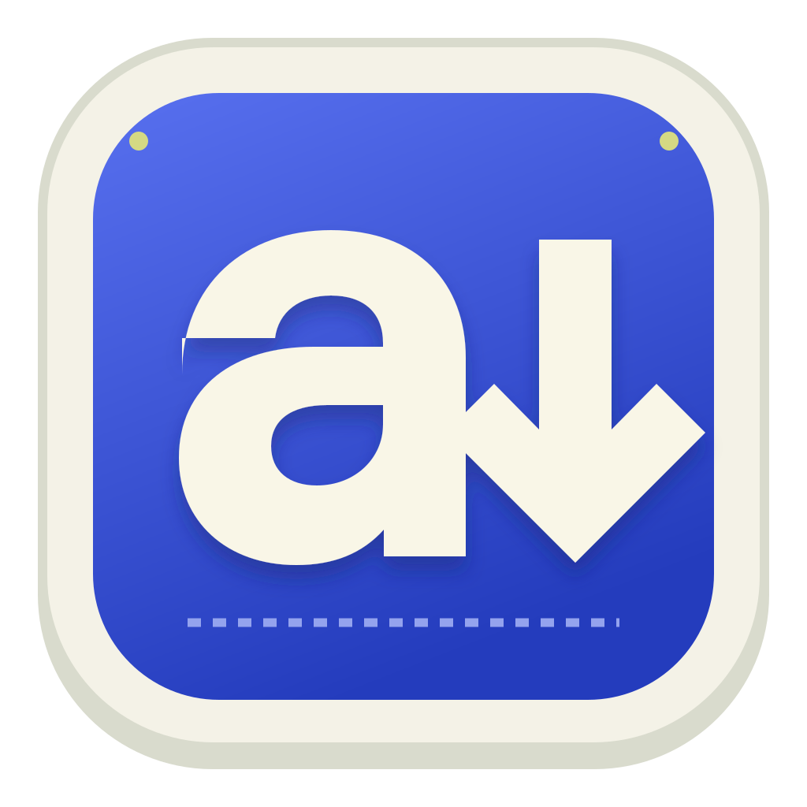
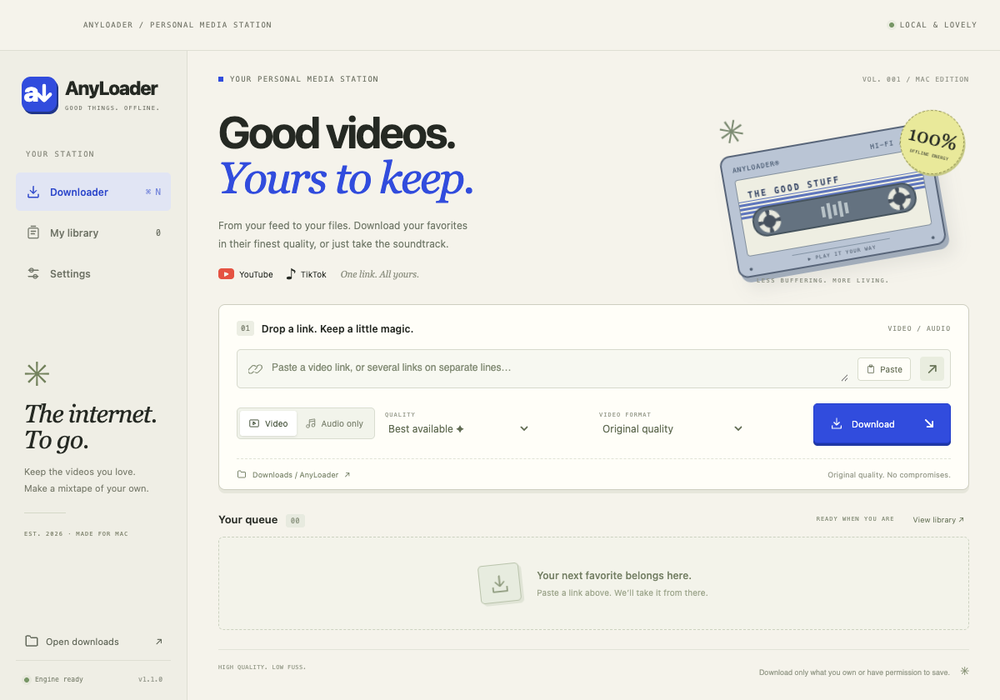
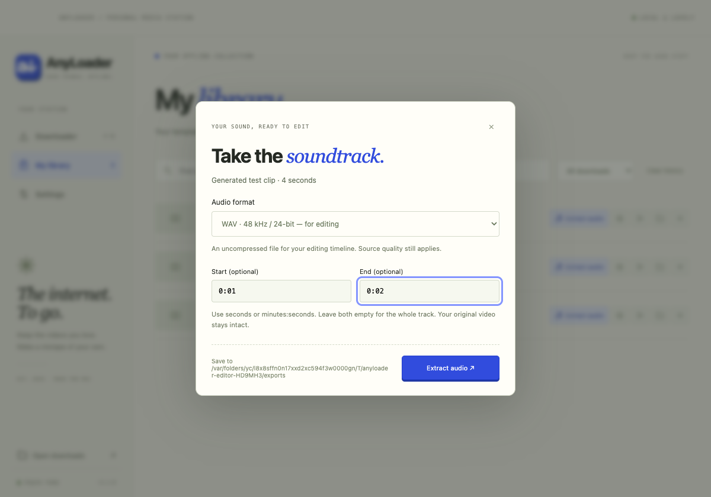
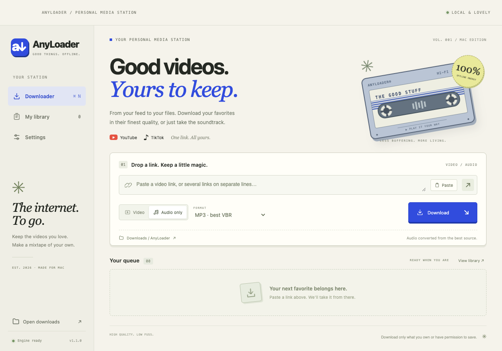
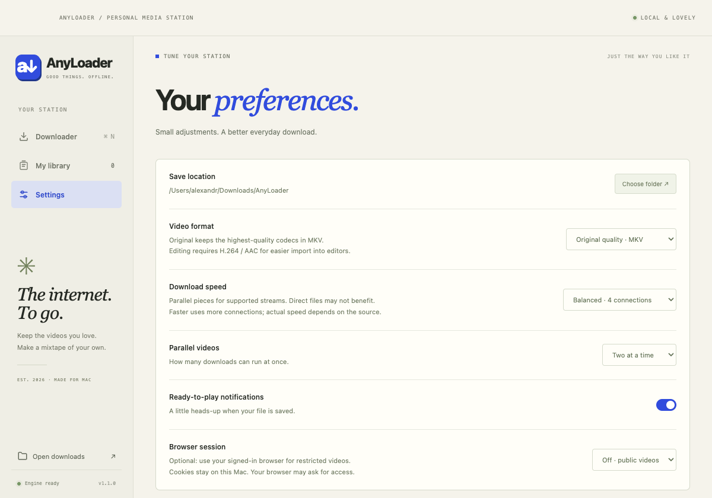
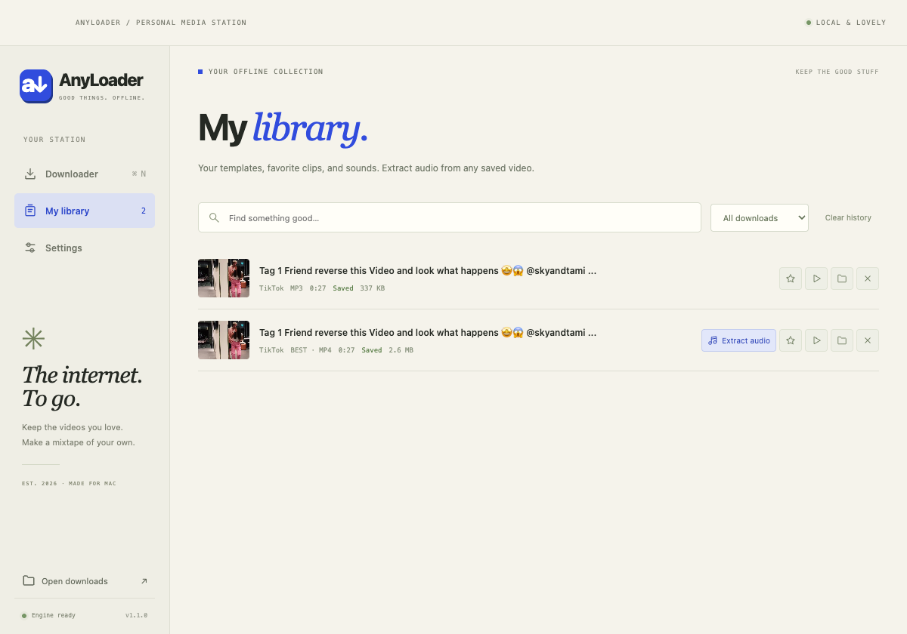

<div align="center">
  
  <h1>AnyLoader</h1>
  <p><strong>A little retro. A lot of resolution.</strong></p>
  <p>Your personal media station for Mac.<br>Collect editing references. Save templates. Take the soundtrack.</p>
  <p>
    
    
    
  </p>
  <p><a href="https://github.com/alexandr-shalanin/anyloader/releases/latest"><strong>Download for Mac ↗</strong></a> · <a href="#getting-started">Getting started</a> · <a href="#development">Build your own</a></p>
</div>



## The internet. To go.

AnyLoader is a standalone desktop app with the warmth of a 90s mixtape: paper tones, a cobalt accent, tiny utility labels, and a gently spinning cassette. Paste a link, pick your quality, and let it do the rest.

No terminal, Homebrew, or separately installed download tools are needed to **use the packaged app**. yt-dlp, FFmpeg, FFprobe, and Deno travel with it.

| Your favorite things | Ready for your Mac |
| --- | --- |
| **YouTube & TikTok** | Individual videos, Shorts, and TikTok share links. |
| **Best available quality** | Selects the best video and audio streams, then merges them. No artificial resolution cap on “Best available.” |
| **Just the soundtrack** | Download original audio, MP3, M4A, FLAC, or WAV. Extract audio from a saved library video without downloading again. |
| **Made for your edits** | H.264/AAC MP4 option, 48 kHz / 24-bit WAV exports, and optional start/end times for sound clips. |
| **A proper queue** | Live progress, speed, ETA, one to three simultaneous downloads, pause, resume, cancel, and retry. |
| **Your offline library** | Persistent history, favorites, search, video/audio/export filters, playback, and Show in Finder. |
| **Less waiting** | Instant batch queueing for up to 20 links, a single metadata/download pass, and configurable parallel fragments. |
| **Feels at home** | Custom Dock icon, Dock progress and badge, native menus, folder picker, and optional notifications. |
| **Quiet by design** | No analytics, account, subscription, or application backend. Preferences and history stay on your Mac. |
| **A little motion** | Animated tape reels and gentle transitions, with support for Reduce Motion. |

## Getting started

1. Download the Apple Silicon ZIP from [Releases](https://github.com/alexandr-shalanin/anyloader/releases/latest).
2. Unzip it and move **AnyLoader.app** into **Applications**.
3. Open it, then right-click its Dock icon → **Options → Keep in Dock**.
4. Paste a YouTube or TikTok video link (or up to 20 links, one per line). Choose **Video** or **Audio only**, select a quality or format, and press **Download**.

Files go to `~/Downloads/AnyLoader` by default. Click the destination below the download controls to choose another folder. Closing the window leaves the app and its downloads running; **⌘ Q** quits and pauses unfinished work. Open it again and press Resume to continue where the source supports it.

**Release signing:** the app is locally/ad-hoc signed, not Apple Developer ID signed or notarized. macOS may require **System Settings → Privacy & Security → Open Anyway** after a first launch attempt. Only do this for a build you trust. macOS 13 or later is required; published binaries target Apple Silicon. Intel Macs can build from source on an Intel Mac.

## Pick your flavor

**Original quality · MKV** is the default. It preserves the highest-quality available source codecs, including AV1 or VP9 where offered. MKV is used when separate streams need merging; a source already containing both tracks can keep its original container. Use a player that supports the source codecs and container.

**Editing MP4**, next to the quality selector, selects H.264 video and AAC audio for easier importing into editors. This can have a lower resolution than the original-quality option. If a source does not provide those codecs, AnyLoader reports that clearly instead of silently falling back to a different codec. It does not transcode video or invent higher resolutions.

Resolution selections are **upper limits**. A 720p source cannot become real 4K. “Original audio” preserves the best available audio; MP3 uses the encoder's highest VBR quality. FLAC and WAV conversions do not restore detail that the source already lost.

## From library to timeline

1. Open **Library** and click **Extract audio** on a completed video.
2. Choose **WAV · 48 kHz / 24-bit** for an editing-friendly file, or MP3, M4A, or FLAC.
3. Leave the time fields blank for the whole soundtrack, or enter a start and end such as `0:12.500` and `0:18`.
4. Press **Extract audio**. The export appears as a separate library item in your current download folder. The original video is never changed or overwritten.

This runs locally using the saved file, with no new download or sign-in required. The first audio track is exported. Moved or silent videos get a clear error; pause/resume restarts a local export. Use the **Extracted audio** filter to find exports, and the star button to collect reusable templates in **Favorites**.



<details>
<summary><strong>Take the soundtrack — real audio-mode screenshot</strong></summary>



</details>

<details>
<summary><strong>Tune your station — real preferences screenshot</strong></summary>



</details>

<details>
<summary><strong>Keep the good stuff — actual completed TikTok downloads</strong></summary>



</details>

All screenshots are captured directly from the running Electron application. The audio-export dialog uses a real generated four-second test video; the completed-download screenshot shows actual TikTok downloads. Test media is not shipped with the app.

## Download speed, honestly

Links now enter the queue immediately; metadata arrives during the download process instead of requiring a separate preflight pass. **Settings → Download speed** offers conservative (1), balanced (4, default), or fast (8) simultaneous fragments for supported DASH/HLS streams. Parallel videos is a separate setting.

Fragment concurrency does not speed up every source: direct-file downloads, server limits, Wi-Fi, and your available bandwidth still matter. More connections can also trigger rate limits. Start with Balanced and lower it if you see failures. AnyLoader retries transient failures with backoff and prevents idle system sleep while jobs are active; it cannot override lid closure or deliberate sleep. No fixed speed multiplier is promised.

## A few useful details

- **Preview a link:** use the arrow next to Paste to check the title, author, duration, and available resolution before downloading.
- **Keyboard shortcuts:** ⌘ Enter to queue pasted links, ⌘ N for a new download, ⌘ , for settings, ⌘ ⇧ O for the downloads folder, and standard Mac copy/paste shortcuts.
- **Remembered choices:** your last-used video/audio mode, quality, format, and container become the next session's defaults. Duplicate active jobs with identical settings are skipped.
- **Restricted videos:** Settings → Browser session can use a browser you are already signed into. This is opt-in, and the browser or macOS may request access. It does not bypass permissions, DRM, payment, or availability restrictions.
- **Interrupted downloads:** partial media stays in the destination to support resuming. Cancel and history removal do not delete downloaded or partial files.
- **File variants:** filenames include the source ID and selected format/quality so different versions can coexist.
- **History:** stored in `~/Library/Application Support/AnyLoader/library.json`. If a history file cannot be read, a recovery copy is preserved.
- **Scope:** individual videos only; playlists, entire channels, and ongoing live streams are intentionally not supported.
- **Service changes:** YouTube and TikTok can change their endpoints, request sign-in, rate-limit requests, or block videos by region. These restrictions can prevent a particular download. Update the bundled engine when extractors change.

Download only media you own or have permission to save, and respect the source platform's terms.

## Development

Requirements: macOS, Node.js 22.12+ (Node 24 LTS recommended), npm, and Apple's Command Line Tools (`xcode-select --install`).

```sh
git clone https://github.com/alexandr-shalanin/anyloader.git
cd anyloader
npm ci
npm run setup
npm start
```

The first setup downloads an official yt-dlp release, verifies its SHA-256 checksum, and builds FFmpeg/FFprobe with LAME from source. Allow several minutes for compilation. Deno is installed for the Mac's architecture. Subsequent setup runs reuse the media build and refresh yt-dlp. Set `YTDLP_VERSION` to an official release tag to choose a specific engine version.

```sh
npm test         # URL security, format selection, and progress parsing
npm run test:ui  # Run the desktop UI checks and refresh real screenshots
npm run test:media # Verify real local downloads, merging, and audio conversion
npm run test:editor # Verify offline exports, trimming, favorites, and batch queueing
npm run build    # Generate the app icon, package, ad-hoc sign, verify, and zip
```

The app is written to `dist/AnyLoader-darwin-arm64/AnyLoader.app` (or `darwin-x64` when built on Intel). Distribution ZIPs are written alongside that folder.

```text
src/
  main.cjs           Mac integration, download queue, persistence, narrow IPC
  preload.cjs        Sandboxed bridge between UI and desktop capabilities
  core.cjs           URL validation, media selection, progress parsing
  local-media.cjs    Offline audio export, time ranges, probing, cancellation
  renderer/          Interface, cassette illustration, animations
scripts/
  setup.mjs          Verified downloader and bundled engine setup
  build-media.mjs    FFmpeg + FFprobe + LAME compilation and source manifest
  build.mjs          Icon generation and standalone Mac packaging
  smoke.mjs          Real Electron UI checks and screenshots
test/                Download logic tests
docs/screenshots/    Unaltered captures of the running interface
```

The renderer has Node integration disabled, context isolation and sandboxing enabled, a restrictive Content Security Policy, and an explicitly defined preload API. Navigation and new windows are denied. Input URLs are validated against supported domains, and subprocesses use argument arrays without a shell. Local yt-dlp configs and plugins are disabled. Remote titles are escaped before rendering.

## Built on good things

[Electron](https://www.electronjs.org/) · [yt-dlp](https://github.com/yt-dlp/yt-dlp) · [FFmpeg](https://ffmpeg.org/) · [LAME](https://lame.sourceforge.io/) · [Deno](https://deno.com/)

AnyLoader's source is [MIT licensed](LICENSE). Bundled tools retain their own licenses. Our FFmpeg build excludes GPL and nonfree components. The app includes the unmodified FFmpeg and LAME source archives, build manifest, and license texts in `Contents/Resources/vendor`; see [third-party notices](THIRD_PARTY_NOTICES.md).

---

<div align="center"><sub>HIGH QUALITY. LOW FUSS.<br>Made for Mac by <a href="https://github.com/alexandr-shalanin">alexandr-shalanin</a> · EST. 2026</sub></div>
